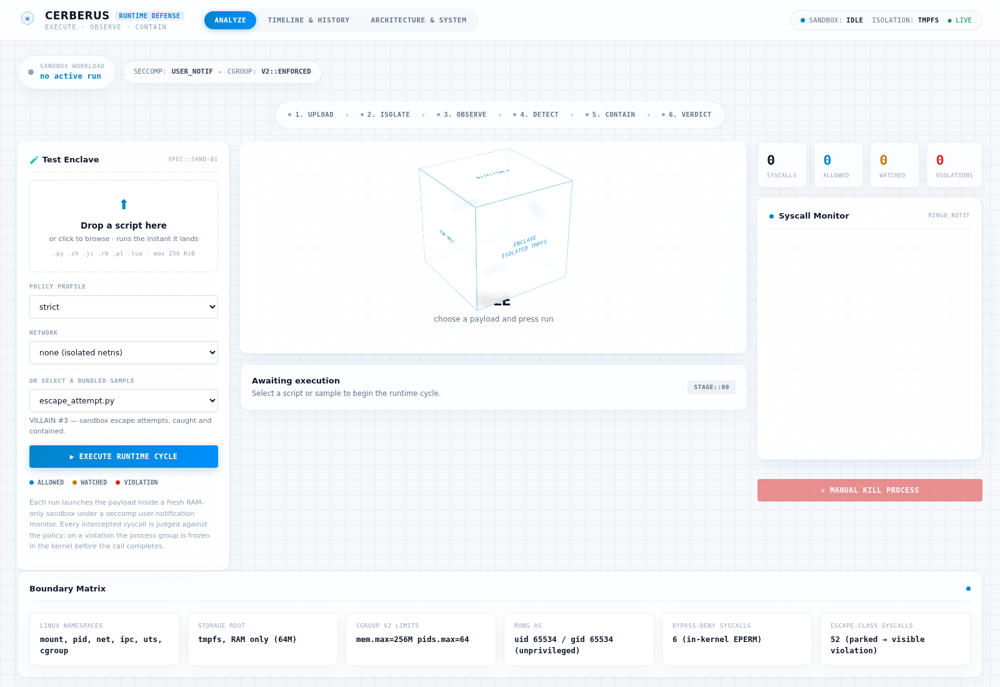
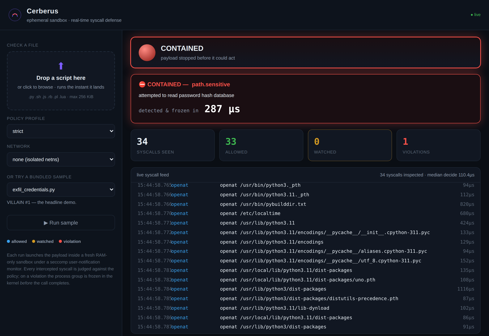

# Cerberus

**An ephemeral RAM-disk sandbox with real-time, kernel-level exfiltration defense.**

Cerberus runs untrusted code inside a disposable, memory-only sandbox and watches
every system call it makes *as the kernel is about to execute it*. If the code
tries something it shouldn't — reading a credential file, opening an outbound
connection, spawning a new namespace — Cerberus freezes the entire process group
in the kernel **before the syscall completes**, typically in **under 200
microseconds**. Nothing leaks, and nothing is left on disk when the session ends.

> Built for VinHack 2026 · Trust, Safety & Digital Security track.

---

## The one-sentence pitch

Falco tells you a container did something bad *after the fact*; Cerberus stops
the process *mid-syscall*, and wraps isolation, detection, and response into a
single tool with a live dashboard — with a measured detect-to-freeze latency on
screen.

## Why it's not "just Firejail + Falco"

| | Firejail / bwrap | Falco | **Cerberus** |
|---|---|---|---|
| Isolation (namespaces, tmpfs) | ✅ | ❌ | ✅ |
| Sees syscall **arguments** | ❌ | ✅ | ✅ |
| Acts **before** the syscall runs | ❌ | ❌ (reports after) | ✅ |
| Automated freeze/kill response | ❌ | needs Talon/webhooks | ✅ built-in |
| Nothing touches disk | partial | ❌ | ✅ (tmpfs, gone at exit) |
| Live latency-instrumented dashboard | ❌ | via Grafana | ✅ native |

The genuine gap Cerberus fills: Falco is headless and is normally paired with a
*separate* response engine. Cerberus ties detection directly to an in-process
freeze-and-sever loop, tied to an ephemeral sandbox, in one cohesive tool.

---

## How it works

Three layers, meeting at one seam.

```
        ┌─────────────────── supervisor process ───────────────────┐
        │   monitor thread          policy engine        responder  │
        │   (reads notif fd)  ──►   (allow/deny/watch) ──► freeze()  │
        └──────────▲───────────────────────────────────────┬───────┘
                   │ seccomp user-notif fd (pulled via       │ cgroup.freeze
                   │ pidfd_getfd — never sent over a socket)  │ / cgroup.kill
        ┌──────────┴──────────── sandbox ─────────────────▼───────┐
        │  new namespaces: mount · pid · net · ipc · uts · cgroup   │
        │  tmpfs root (RAM only) · read-only bind mounts · rlimits  │
        │  seccomp filter installed, then execve(untrusted code)    │
        └──────────────────────────────────────────────────────────┘
```

1. **Isolation.** `unshare` into fresh namespaces, build a `tmpfs` root, bind the
   interpreter and libraries in read-only, `pivot_root`, and cap resources with
   cgroup v2. Nothing the payload does touches persistent disk.

2. **Observation.** A hand-assembled **seccomp filter** (built with `ctypes`, no
   libseccomp, no eBPF toolchain) sorts every syscall into three classes:
   - **hard-deny** — refused in-kernel with `EPERM`, no userspace round trip
     (`ptrace`, `mount`, `bpf`, `io_uring`, `setns`, …).
   - **notify** — parked and handed to the supervisor via
     `SECCOMP_RET_USER_NOTIF`, which reads the arguments out of the target's
     memory (TOCTOU-safe, see below) and judges them.
   - **allow** — everything a normal program needs.

3. **Response.** On a violation the supervisor writes `cgroup.freeze`, stopping
   every task in the group atomically, and **leaves the offending syscall
   parked** — an unanswered notification blocks that thread inside the kernel
   forever, so it never returns to userspace. Teardown uses `cgroup.kill`, which
   SIGKILLs even a frozen group without ever giving it another scheduling slice.

### Two design decisions worth knowing

- **Default-deny, not blocklist.** The syscall policy and the contextual rules
  are both allowlists. A file read is permitted because its path is under an
  allowed prefix, not because it failed to match a "known bad" list — so a
  credential file nobody enumerated is still stopped.

- **The listener fd is *pulled*, not *pushed*.** The seccomp listener fd can't be
  sent to the supervisor over a socket: `sendmsg`/`SCM_RIGHTS` is itself in the
  notify set, so the kernel would park the very syscall carrying the fd, waiting
  on a verdict that needs that fd — an unbreakable deadlock. Cerberus installs
  the filter in the sandbox, then the supervisor pulls the fd out with
  `pidfd_open` + `pidfd_getfd`. All setup signalling rides on plain pipes, whose
  `read`/`write` are not notified. (This bites everyone who builds on
  seccomp-notify; it's documented here so you don't rediscover it at 3am.)

- **TOCTOU safety.** Arguments are read from `/proc/<pid>/mem`, then re-validated
  with `SECCOMP_IOCTL_NOTIF_ID_VALID`. A still-valid id proves the target stayed
  blocked in-kernel the whole time and couldn't have swapped the bytes after we
  read them.

---

## Native desktop app (no browser)

Prefer a real application window with native widgets and no web anything? See
[`NATIVE.md`](NATIVE.md):

```bash
./run-native.sh        # opens the Tkinter window; Open a script to check it
```

## The entry point: drop a file, watch it get checked

The primary way to use Cerberus is the web dashboard's **drag-and-drop upload**:
drop any script (`.py .sh .js .rb .pl .lua`, ≤ 256 KiB) onto the page and it runs
*the instant it lands* inside a fresh sandbox, with every syscall streaming to the
feed and a verdict at the end. No command line, no pre-registered payloads. The
bundled sample villains are still there as a one-click "or try a sample".

Upload safety (the upload endpoint is a public attack surface, so it's treated as
one):

- **size-limited** — 256 KiB, rejected before the body is read into memory.
- **rate-limited** — 20 runs per minute per client, one session at a time.
- **validated** — filename sanitised (no path traversal), extension must map to a
  known interpreter, binary blobs refused.
- **unprivileged** — uploaded code runs as uid 65534 (nobody), never root.
- **time-boxed** — a hard wall-clock limit per run; the sandbox is torn down and
  its tmpfs discarded when the session ends.

## Quick start

Needs a Linux box with **cgroup v2** and a kernel **≥ 5.14** (for `cgroup.kill`;
5.9+ works with a slightly weaker teardown). Run as root — sandboxing needs
`mount`, cgroup, and `seccomp` privileges.

```bash
# 1. The live dashboard (the demo) — drag a file onto the page
sudo python3 -m cerberus.web
#    → open http://127.0.0.1:8787, drop a script (or pick a sample), watch it run

# 2. The CLI
sudo python3 -m cerberus.cli run -s payloads/exfil_credentials.py
sudo python3 -m cerberus.cli run -s payloads/benign_wordcount.py
sudo python3 -m cerberus.cli policies

# 3. The test suite (proves the whole chain)
sudo python3 tests/integration.py
```

No third-party packages required — everything is Python standard library plus
the Linux kernel. (`playwright` is only needed to regenerate the screenshot.)

## The demo, in 90 seconds

See [`DEMO.md`](DEMO.md) for the full runbook. The short version:

1. **Drop your own script** on the page (or run `benign_wordcount.py`) → if it's
   clean, the panel turns green, **CLEAN**. Cerberus doesn't cry wolf.
2. Drop / run **`exfil_credentials.py`** → the feed streams dozens of allowed
   syscalls, then a red **VIOLATION** the instant it touches `/etc/shadow`; the
   whole panel goes **FROZEN** with *detected & frozen in ~180 µs* on screen.
3. Run **`exfil_network.py`** under the `loopback` policy → caught at `connect()`
   to a public IP: *attempted outbound connection to 93.184.216.34:443*.
4. Run **`escape_attempt.py`** → six classic sandbox escapes
   (`ptrace`, `mount`, `unshare`, `bpf`, …) each refused in-kernel.




## Policy profiles

| profile | network | loopback | exec | unlisted syscalls |
|---|---|---|---|---|
| `strict` *(default)* | denied | denied | allowed | allowed, logged |
| `loopback` | denied | allowed | allowed | allowed, logged |
| `observe` | allowed | allowed | allowed | allowed (no freeze — records only) |
| `paranoid` | denied | denied | **denied** | **denied** (strict allowlist) |

## Layout

```
cerberus/
  seccomp.py   hand-assembled BPF + user-notif listener (ctypes only)
  sandbox.py   namespaces, tmpfs root, pivot_root, the pidfd handshake
  cgroup.py    cgroup v2 membership, freeze, atomic kill
  policy.py    default-deny classes + contextual argument rules
  monitor.py   the observe→decide→respond loop, latency-instrumented
  runner.py    session orchestration and verdict
  events.py    non-blocking fan-out event bus
  web.py       dependency-free HTTP + WebSocket dashboard, drag-and-drop upload
  cli.py       `cerberus run`
static/index.html   the live dashboard
payloads/      four villains and one benign control
tests/         smoke test (seccomp) + full integration suite
```

<<<<<<< HEAD
## Hardening

Cerberus has had a hardening pass that closes real evasion bypasses — symlink and
`..` escapes, seccomp TOCTOU, the x32 ABI, dropped-binary execution, capability
retention, and more. Each is verified by `tests/hardening.py`. See
[`HARDENING.md`](HARDENING.md) for the full table and the roadmap to a
VM-grade boundary ([`packaging/run_in_vm.md`](packaging/run_in_vm.md)).

=======
>>>>>>> 0cb50cc192b421946859b139e4e717e50e53c739
## Honest limitations

- A ptrace/namespace sandbox is **not** a hardened boundary against a
  well-resourced attacker the way a user-space kernel (gVisor) is. Cerberus is a
  lightweight, demo- and learning-oriented tool, and says so.
- Resource caps (`pids.max`, `memory.max`) require the relevant cgroup
  controllers to be delegated to the sandbox's cgroup; where they aren't,
  Cerberus reports the degraded caps and continues (the syscall monitor is
  unaffected).
- `x86-64 only` — the filter refuses other architectures by design rather than
  guessing their syscall tables.

## License

MIT. See [`LICENSE`](LICENSE).
